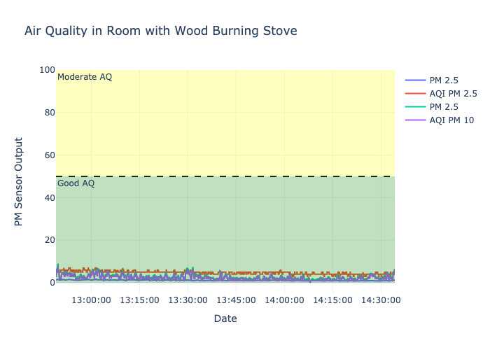

# Remote Air Quality Station

**Work in Progress**

Remote PM 2.5 SDS011 air quality station with temperature, pressure, and humidity. Two versions can be run, one while using the Raspberry Pi Touch Display, and the other while running a headless Raspberry Pi.

## Hardware

Demo Version:
- Raspberry Pi 4 4GB
- Nova Pm Sensor SDS011
- Raspberry Pi Sense Hat
- Battery Pack (Will Update)
- Raspberry Pi Touch Display (Will Update)

## Dependencies

```bash
pip install python-aqi
pip install plotly
```
## Commands from terminal
Workflow:

Prior to remotely running headless pi, connect local laptop and pi to a wireless hotspot and record the pi's IP address.

When powering on the pi, make sure wireless hotspot is connected to both devices.

Tip: If pi cannot connect, open Personal Hotspot in Settings on your iphone and leave it open. Running ssh bash command to connect to the pi should then work.

Connect to pi using ssh in shell
```bash
ssh pi@IP
```
Check working directory
```bash
pi@raspberry:~ $ pwd
```
Change directory to desired file save location
```bash
pi@raspberry:~ $ cd /home/pi/directory
```
To check list of files in directory use:
```bash
ls
```
Run test script and check output
```bash
pi@raspberry:~/home/pi/directory $ python3 test.py
```
There are three alternative ways to set up and run the air quality monitoring. If you intend to have internet connection between your pi and local computer for the entire test run the below code. If you intend to only be connected on start up or not at all follow the below instructions.

Run Sensor. Output will stream in the shell until run is complete.
```bash
pi@raspberry:~/home/pi/directory $ python3 senseAir.py -a 1 -r 100
```

If you only have a connection at the beginning of sampling and at the end, you can use the nohup command, such that your python program will continue to run after your ssh connection disconnects. Run the below code if this is the case. You can reconnect over a ssh again once the test is completed. Output will still be saved to your long file.

```bash
nohup python3 senseAir.py -a 3 -r 600 &
```

If you will not have any connection with your pi prior to sampling, you can have the pi begin air sampling on boot. You will need to edit your program prior to running, as you'll need to set the default parameters to fit your needs.

Transfer log file from pi onto local computer. Remember to change your directory on your local machine to the location where you want the file saved. Run this from local bash in new shell terminal. Make sure not to disconnect ssh connection with pi (this might actually not matter).
```bash
scp pi@IP:/home/pi/directory/aq_log.txt aq_log.txt
```
To turn off the pi from the shell
```bash
sudo shutdown -h -P now
```
After file is saved. Open terminal and run plot_ssd.py script. Make sure file is located in your current working directory. At the moment, the path to the air quality log file is not set. Open plot_ssd.py in a text editor and edit line 15 to the path of your now saved log file.

```python
path = r'Path' #edit this line such that the log file can be found
```
After plot_ssd.py has been edited and saved run in terminal:
```base
python plot_ssd.py
```
A plot of the air quality data should appear in your safari browser. If it does not, you may need to install plotly first onto your machine using pip.

## Example Outputs

### Air Quality in the Office


Air was sampled for 1:45.14 hours.

### Air Quality Near a Wood Burning Stove


Air was sampled for 1:03.12 hours.

### Plotted at the Same Scale

To compare the air quality between the office and the house (wood burning stove) I re-plotted the results with the same axis and with the AQI ranges. As you can see the office air was in the 'Good' range for the entire test. The wood burning stove in contrast shows moderate air quality. The initial spike in the wood burning plot was due to us putting a new log on the fire.




